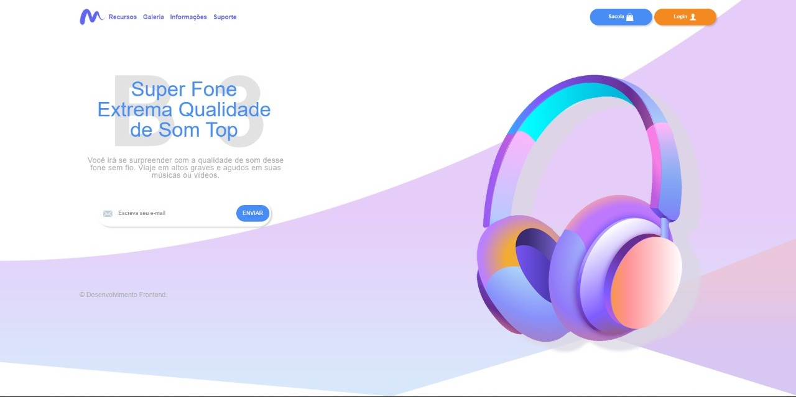

<h1>
    Template Super Fone
</h1>

        
    

 
<h1>
    

        <a style="font-size: 20px" href="https://super-fone.netlify.app/" target="_blank"> Veja o Site</a>
    

</h1>

<h2> 💻 Projeto </h2>

Segue o template construído do zero, desde a criação do layout até a responsividade.

 
<h1>

<h2> 📈 Conhecimento adquirido </h2>

* Criação de Layout utilizando Adobe XD
* Aprendi a trabalhar com Flebox
* Aprendi a trabalhar com o recurso do CSS3 Grid Layout
* A importância da organização do CSS com a utilização do ITCSS
* Trabalhar com unidades de medidas responsivas
* Trabalhar com Media Queries
* Zeplin
* Aprendi a desenvolver sites responsivos que se ajuste a qualquer tamanho de tela.

 

<h2> 🛠 Tecnologias usadas </h2>

O projeto foi desenvolvido utilizando as seguintes tecnologias:

- [HTML](https://www.w3schools.com/html/)
- [CSS](https://www.w3schools.com/css/)
	

 
 

 Desenvolvido com 💜 por Leandro Pereira ✌🏽 

 

<a href="./README.md"><< Voltar</a>

